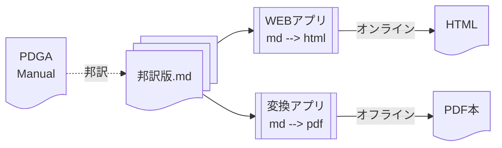

# ディスクゴルフ競技マニュアルの邦訳化

これは、[PDGA®](https://www.pdga.com/)の[Competition Manual for Disc Golf Events](https://www.pdga.com/rules/competition-manual-disc-golf-events)の日本版を作成するプロジェクトです。

主に以下の作成を目標にしています:

1. [競技マニュアルの邦訳版](cm/README.md)の作成、
1. オンライン版(Webアプリ)の作成、
1. [オフライン版(PDF本版)の作成](pandoc/README.md)。

邦訳版、オンライン版、オフライン版の関連を俯瞰すると、
以下の通りになります。

