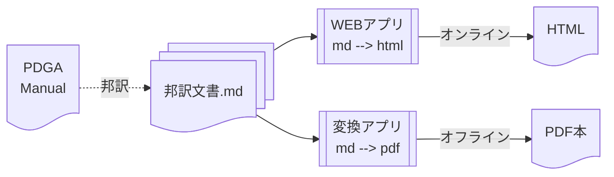

# ディスクゴルフ競技マニュアルの邦訳

ここはPDGAの[Competition Manual for Disc Golf Events](https://www.pdga.com/rules/competition-manual-disc-golf-events)を翻訳しそれを公開するためのプロジェクトです。

主に以下の作成を目標にしています:

1. [邦訳文書](cm/README.md)の作成、
1. オンライン版(Webアプリ)の作成、
1. [オフライン版(PDF本版)の作成](pandoc/README.md)。

なお、本プロジェクトを含む一連のプロジェクトによる成果は、
[ディスクゴルフの公式規則と競技マニュアル](https://jpdga-shizuoka.github.io/documents/)
で参照できます。
