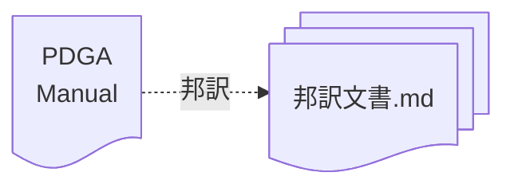

# 競技マニュアルの邦訳

PDGAが公開する[Competition Manual for Disc Golf Events](https://www.pdga.com/rules/competition-manual-disc-golf-events)を邦訳しました。

## ファイル形式

邦訳文書はマークダウン形式を採用しています。

## Copyrights

The original copyrights of these contents are reserved by PDGA.
