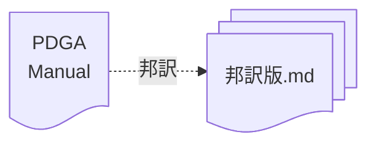

# 競技マニュアルの邦訳

PDGAが公開する[Competition Manual for Disc Golf Events](https://www.pdga.com/rules/competition-manual-disc-golf-events)の直訳版です。

## ファイル形式

本邦訳版のファイル形式は、
マークダウン形式を採用しています。

## Copyright

The original copyright of these contents is reserved by PDGA®.
